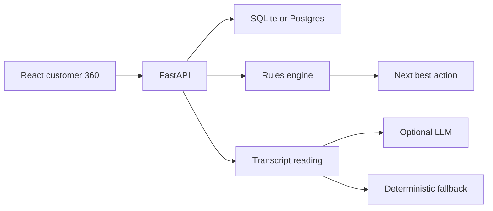

# Customer-360

Customer 360 and next best action for an insurance and lending book.

A relationship manager picks a customer, sees policies, loans, payments, claims, and call transcripts on one file, and gets a recommended action that explains itself. The demo runs locally on seeded data. It does not need an API key, a database server, or a cloud account.

## What to show a judge

1. Open the overview. The tiles, charts, and action queue are the book at a glance. The six story cards are the cases worth walking through.
2. Open **Priya Nair**. She is high churn risk: a negative call, claim `CLM-3391` still in review, and a renewal in 16 days. Expand the latest call and show the extracted sentiment, intent, and quote. The next best action is a retention call that closes the claim before renewal, with the evidence and the rule trace on the card.
3. Ask “Why is this customer at risk?” The answer stays on her file and ends with a recommended action. Record the call. It appears on the timeline.
4. Open **Arjun Mehta** for a cross-sell (mortgage on the books, he asked for a homeowners quote) and **Daniel Brooks** for a healthy file where the engine says not to call.
5. Open **Hannah Berg**, mark the travel claim resolved, and show the recommendation recalculate. Use **Reset demo data** in the sidebar to restore the book.

Other files worth one sentence each:

| Customer | Why it is there |
| --- | --- |
| James Okonkwo | Negative sentiment and an unresolved complaint |
| Mei Chen | Upcoming renewal, calm customer, cover needs an update |
| Elena Vasquez | High-value client, service failure, do not lead with a discount |
| Sofia Alvarez | Two missed loan payments and a hardship call |
| Robert Hale | Denial plus a threat to involve the insurance department |
| Thomas Berger | Shopping on price, so a bounded concession is the lever |
| Yuki Tanaka | Claim file does not agree with itself; pause promises |

## Run it

Use two terminals. Python 3.11+ and Node 20+ are enough.

**API**

```powershell
cd backend
python -m venv .venv
.\.venv\Scripts\Activate.ps1
pip install -r requirements.txt
uvicorn app.main:app --reload --host 0.0.0.0 --port 8000
```

macOS or Linux: `source .venv/bin/activate` instead of the PowerShell activate line.

**Web**

```powershell
cd frontend
npm install
npm run dev
```

Open [http://localhost:5173](http://localhost:5173). API docs are at [http://localhost:8000/docs](http://localhost:8000/docs).

### Render

The API and PostgreSQL can be created from `render.yaml`, or by hand:

1. Create a PostgreSQL database on Render.
2. Create a Web Service from this repo. Set the root directory to `backend`.
3. Build command: `pip install -r requirements.txt`
4. Start command: `uvicorn app.main:app --host 0.0.0.0 --port $PORT`
5. Set `DATABASE_URL` to the database connection string Render provides. A `postgres://` URL is accepted. Use the internal URL when the service and database are in the same region.
6. Deploy. The first boot creates the tables and loads the 28 demo customers.

Point the site at that API by setting `VITE_API_URL` in `frontend/.env` to the Render service URL, with no trailing slash, then rebuild the frontend.

The first launch creates `backend/customer360.db` and seeds 28 customers. There is no login.

### Checks

```powershell
cd backend
.\.venv\Scripts\python.exe -m pytest
```

```powershell
cd frontend
npm run build
```

## Optional language model

Copy `.env.example` to `backend/.env` and set `OPENAI_API_KEY`. Any OpenAI-compatible chat endpoint works via `OPENAI_BASE_URL` and `OPENAI_MODEL`.

What the key changes:

- **Ask about this customer** sends the file and returns a grounded answer.
- **Re-read interactions** re-extracts sentiment, intent, concerns, and a quote.

If the key is missing, invalid, or the call fails, the same screens use the rules engine. Seeded readings stay deterministic even when a key is present, so the demo does not change shape on startup. There is no paid dependency required to judge the project.

## Architecture



The browser talks only to the API. Locally the API uses SQLite. On Render it uses PostgreSQL. Both hold customers, products, payments, cases, interactions, and recorded actions. On each request the API rebuilds the Customer 360 from those rows.

Transcript reading and the decision are separate on purpose:

1. Reading turns a call or email into sentiment, intent, topics, concerns, urgency, entities, churn language, and a quote.
2. The next best action uses that reading plus the structured file: renewal dates, open claims, complaints, missed payments, lapses, and relationship value.
3. The action card shows confidence, the evidence (each item opens the related timeline event), the conditions that were evaluated, and the alternatives that were set aside.

The NBA engine evaluates customer signals, interaction insights, business rules, and eligibility conditions, then selects the highest-priority recommended action. The trace on the card follows this order:

1. Regulator language on an open dispute → escalate
2. Claim file in special review → escalate, and do not promise a payout
3. Missed loan payments → hardship or installment call
4. Open complaint → resolve it before any offer
5. Renewal inside 45 days plus an open claim or exit language → retention call
6. Open claim → status follow-up
7. Lapsed policy → win-back
8. Open service request → finish it; a high-value unhappy client gets a senior retention call, not a discount
9. High value, exit language, and no open failure → bounded concession
10. Healthy renewal inside 75 days → renewal offer
11. The customer asked about a product → quote that product
12. A promised callback → schedule it
13. Otherwise → no action

## API

| Method | Path | Purpose |
| --- | --- | --- |
| GET | `/api/health` | Status, customer count, `rules` or `llm` |
| GET | `/api/dashboard` | Tiles, charts, story cards, queue |
| GET | `/api/customers` | Search and filters: `q`, `risk`, `sentiment`, `book`, `segment`, `needs_action`, `churn`, `open_issue`, `sort` |
| GET | `/api/customers/{id}` | Full Customer 360 |
| POST | `/api/customers/{id}/analyze` | Re-read interactions |
| POST | `/api/customers/{id}/ask` | `{ "question": "..." }` |
| POST | `/api/customers/{id}/actions` | Record `{ action_type, title, outcome, note }` |
| PATCH | `/api/cases/{id}` | `{ "status": "Resolved" }` recalculates the action |
| GET | `/api/actions` | Queue of customers who need a next step |
| POST | `/api/demo/reset` | Restore the seeded book |

`outcome` is `Completed`, `Scheduled`, or `Dismissed`. Interactive docs: `/docs`.

## Project layout

```
backend/app/main.py                  API
backend/app/demo_data.py             28 synthetic customers
backend/app/services/nlp.py          Deterministic transcript reading
backend/app/services/engine.py       Risk, summary, next best action
backend/app/services/llm.py          Optional model, with fallback
backend/app/services/assistant.py    Question → action
frontend/src/pages                   Overview, book, queue, Customer 360
```

## Environment

| Variable | Default | Role |
| --- | --- | --- |
| `OPENAI_API_KEY` | empty | Turns on the language model |
| `OPENAI_BASE_URL` | `https://api.openai.com/v1` | Compatible chat endpoint |
| `OPENAI_MODEL` | `gpt-4o-mini` | Model name |
| `DATABASE_URL` | `sqlite:///./customer360.db` | Local SQLite file, relative to `backend/`. On Render, the Postgres URL. |
| `VITE_API_URL` | empty | Leave empty in dev. Vite proxies `/api` to port 8000. Set this to the public API URL when the site and API are on different hosts. |

## Data

The book is fictional. Names, phones, and `mail.example` addresses are not real customers. Figures are US dollars. Dates are stored relative to the day the database is seeded, so renewals and “days ago” stay coherent whenever the demo is launched.
